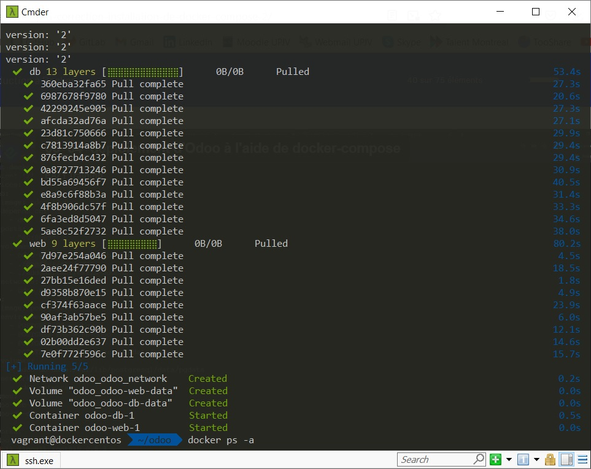
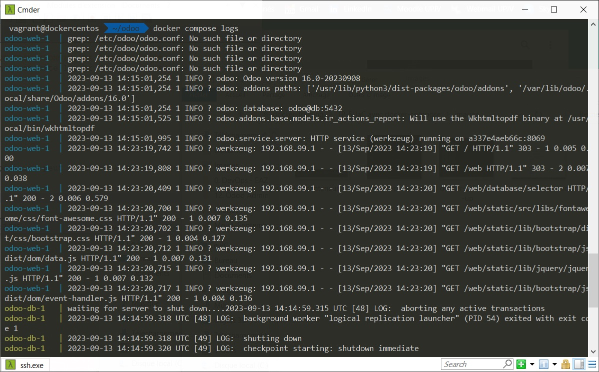
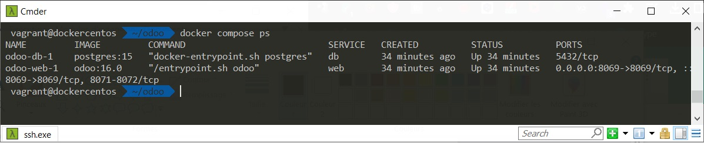
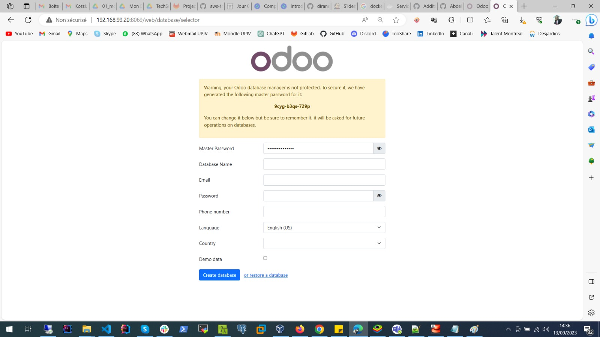

# Infos sur le réalisateur
Session  : Bootcamp DevOps N°15 de Eazytraining

Period   : Septembre à Octobre

Nom      : GBENOU

Prénoms  : Kossi

LinkedIn : https://www.linkedin.com/in/gkossi/

# TP-5 : IaC avec docker-compose
- Déployer le logiciel odoo à l'aide de docker-compose
- Vous pouvez vous inspirer de la documentation disponible sur le dockerhub : https://hub.docker.com/_/odoo
- Modifiez le docker-compose afin d'exposer le port 80 du conteneur odoo à l'extérieur et pas le 8069
- Modifiez le docker-compose afin que le conteneur odoo et db soit dans le meme réseau spécifique qui s'appelle odoo_network et de type bridge
- vérifier que l'application Odoo est bien accessible

## TAF

### ***INSTALLATION DES OUTILS : DOCKER ENGINE ET DOCKER-COMPOSE***

On va procéder à l'installation sur Linux (Centos 7.9) :

- On va installer docker engine et docker compose : 

https://docs.docker.com/engine/install/centos/

https://docs.docker.com/compose/install

sudo yum update -y

sudo yum install -y yum-utils

sudo yum-config-manager --add-repo https://download.docker.com/linux/centos/docker-ce.repo

sudo yum install -y docker-ce docker-ce-cli containerd.io docker-buildx-plugin docker-compose-plugin

- On va activer le démarrage de docker au démarrage du système :

sudo systemctl enable docker

- On va démarrer docker :

sudo systemctl start docker

### ***CONFIGURATION DE DOCKER COMPOSE POUR ODOO : FICHIER DOCKER-COMPOSE.YML***

Ici, nous allons configurer le fichier docker-compose.yml en nous basant sur la documentation de docker pour odoo accessible l'adresse suivante : https://hub.docker.com/_/odoo

Ci-dessous un aperçu du fichier docker-compose.yml :

### ***UTILISATION DU FICHIER DOCKER-COMPOSE.YML POUR PROVISIONNER LES CONTENEURS***

Après configuration du fichier docker-compose.yml, on va ensuite lancer docker compose :

docker compose up -d

On obtient le résultat ci-dessous :

### ***VERIFICATIONS***

Après provisionnement des conteneurs avec docker-compose, on peut procéder à des vérifications comme suit :

- On va vérifier les logs pour voir s'il y a pas eu d'erreur :

docker compose logs

On obtient le résultat ci-dessous :

- On va vérifier si les conteneurs ***Web*** et ***db*** sont bien créés et en cours d'exécution :

docker compose ps

On obtient le résultat ci-dessous :

- On va vérifier si notre application Odoo déployée est fonctionnelle et accessible :

On accède à l'application via le lien suivant : http://192.168.99.20:8069/

On obtient le résultat ci-dessous :

